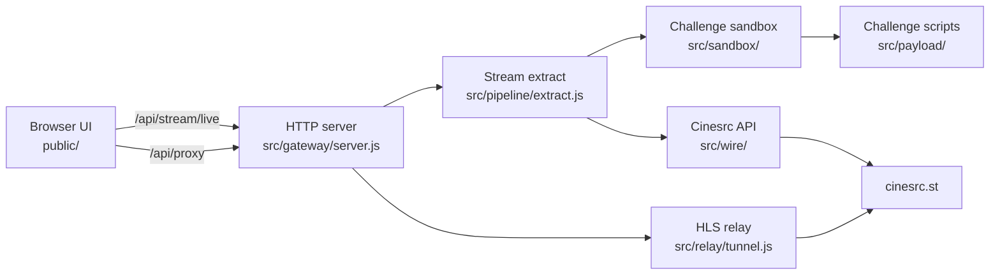

# Cinesrc Stream Resolver

Node.js **HLS stream resolver** for [cinesrc.st](https://cinesrc.st). Maps movie and TV TMDB IDs to embed routes, runs the site’s two-stage challenge in a **JSDOM sandbox**, probes ranked providers sequentially, and serves proxied **m3u8** playback through a local **HTTP API**. Runtime deps: **jsdom** and **canvas** for the embed challenge. **ESM** on Node.js 20+.

## How the stream resolver works

- Builds `/embed/movie/{id}` and `/embed/tv/{id}/{season}/{episode}` paths from a TMDB numeric ID
- Auto-discovers live Next.js server-action IDs from cinesrc client bundles (cached ~30 min; refreshes on stale 404)
- Loads vendored stage-1/stage-2 challenge scripts and runs them in a **server-side** sandbox with canvas, crypto, and PoW worker shims
- Forges a fresh challenge token per provider (single-use), lists mirrors, and probes providers one-by-one by rank
- Emits the first playable stream over SSE, keeps probing the rest in the background, and caches results for instant provider switching in the UI
- Rewrites **m3u8** manifests and forwards segments through `/api/proxy` with required referer headers
- Ships a browser UI with hls.js playback, provider chips, and a copyable proxied link

## Quick start

```bash
git clone https://github.com/sharoon7171/cinesrc-stream-resolver.git
cd cinesrc-stream-resolver
npm install
npm start
```

Open `http://127.0.0.1:8787`, enter a TMDB ID, choose movie or TV (season/episode when needed), and click **Play**.

The first stream can take **10–30 seconds** while the challenge runs. The button shows **Loading…** and the player area shows **Resolving stream…** until the first provider returns a link. Use the video controls to start playback.

Default listen port is `8787` (`PORT` env override). If `npm start` fails with `EADDRINUSE`, stop the process already on that port or set a different `PORT`.

## Network requirements

**Datacenter and VPS IPs are often blocked by cinesrc.st** (HTTP 403 on provider list or stream requests). For reliable upstream access you typically need a **residential proxy** (or another non-datacenter egress IP) on the machine or network running this resolver.

This repo does **not** ship residential proxy configuration. Route outbound traffic through your proxy at the OS, VPN, or network layer, or extend `src/wire/exfil.js` if you want application-level proxy support.

The local **`/api/proxy`** route is **not** a residential proxy — it only relays HLS manifests and segments to the browser so playback works without CORS issues.

## Content paths

| Type  | Cinesrc embed path |
| ----- | ------------------ |
| Movie | `/embed/movie/{id}` |
| TV    | `/embed/tv/{id}/{season}/{episode}` |

`{id}` is the numeric TMDB ID (same number on [themoviedb.org](https://www.themoviedb.org)).

## Environment

| Variable | Default | Purpose |
| -------- | ------- | ------- |
| `PORT` | `8787` | HTTP listen port |

## Streaming API

All routes are served from the root HTTP server.

### `GET /api/stream/live`

Resolve content and stream progress over **Server-Sent Events**.

| Param | Required | Description |
| --- | --- | --- |
| `id` | yes | TMDB numeric ID |
| `type` | no | `movie` or `tv` (default `movie`) |
| `season` | TV only | Season number |
| `episode` | TV only | Episode number |

**Example**

```
GET /api/stream/live?id=1084242&type=movie
```

**SSE events**

| Event | Payload |
| --- | --- |
| `found` | Provider that returned a playable stream (`playUrl`, `url`, `source`, `id`, `name`, …) |
| `ready` | First playable stream plus `providers` and `selectedProvider` — UI loads this into the player |
| `fail` | `{ error, … }` when list or probe fails |
| `done` | Final `providers` list after all ranked probes finish |

The bundled UI connects here, plays on the first `ready` event, and switches providers from cached `found` results without re-running the challenge.

### `GET /api/proxy?url={streamUrl}`

**HLS relay** for browser playback. Playlists are rewritten so segment and key URLs loop back through this endpoint. Binary segments are fetched with the referer headers the CDN expects.

Proxied playback URL shape:

```
http://127.0.0.1:8787/api/proxy?url={encoded_streamUrl}
```

Optional query params: `referer`, and `h_{header}` for extra upstream headers.

## Architecture



### Resolve flow

1. **Path build** — `src/target/routes.js` maps TMDB ID + type into a cinesrc embed path and Next router state tree
2. **Action signs** — `src/target/signs.js` fetches the embed page, scans `/_next/static/chunks/*.js` for `getProviderList` / `getStream` server-action hashes
3. **Provider list** — `src/wire/actions.js` POSTs the list action and parses the mirror ranking
4. **Challenge** — `src/sandbox/frame.js` boots JSDOM, patches vendored scripts, runs stage-1 fingerprint + stage-2 PoW; `src/sandbox/gate.js` returns a `token` used on stream POSTs
5. **Probe** — each provider gets a fresh token; first hit emits `ready`, later hits emit `found`; client caches `playUrl` per provider
6. **Playback** — browser plays through `/api/proxy` so manifests and segments carry the headers the CDN expects

## Project layout

```
src/gateway/server.js       HTTP entry, routes
public/index.html           local player and resolve UI
src/
  pipeline/extract.js       SSE live resolve, sequential probe
  pipeline/pick.js          best mirror pick (HLS > MP4 > …)
  sandbox/frame.js          JSDOM challenge frame
  sandbox/gate.js           challenge token forge
  sandbox/hash-grind.js     PoW worker thread
  wire/actions.js           listMirrors, fetchPayload
  wire/exfil.js             outbound fetch
  target/origin.js          origin, spoof headers, action headers
  target/routes.js          embed paths, route tree
  target/signs.js           server-action ID discovery
  vault/cipher.js           r1 response decrypt
  relay/tunnel.js           m3u8 rewrite and segment relay
  payload/
    050926-prod.js          vendored stage-1 challenge
    donut.js                vendored stage-2 challenge
```

## Reverse-engineering notes

Cinesrc protects embed streams with a two-stage client challenge and encrypted `r1.*` server-action responses. This repo vendors the challenge bundles under `src/payload/` and replays the same `gc()` entry points the browser uses.

When cinesrc redeploys, hardcoded server-action IDs break — `src/target/signs.js` discovers them from live chunks automatically. When cinesrc updates challenge scripts, refresh `src/payload/` from the new embed bundles and re-check patches in `src/sandbox/frame.js`.
